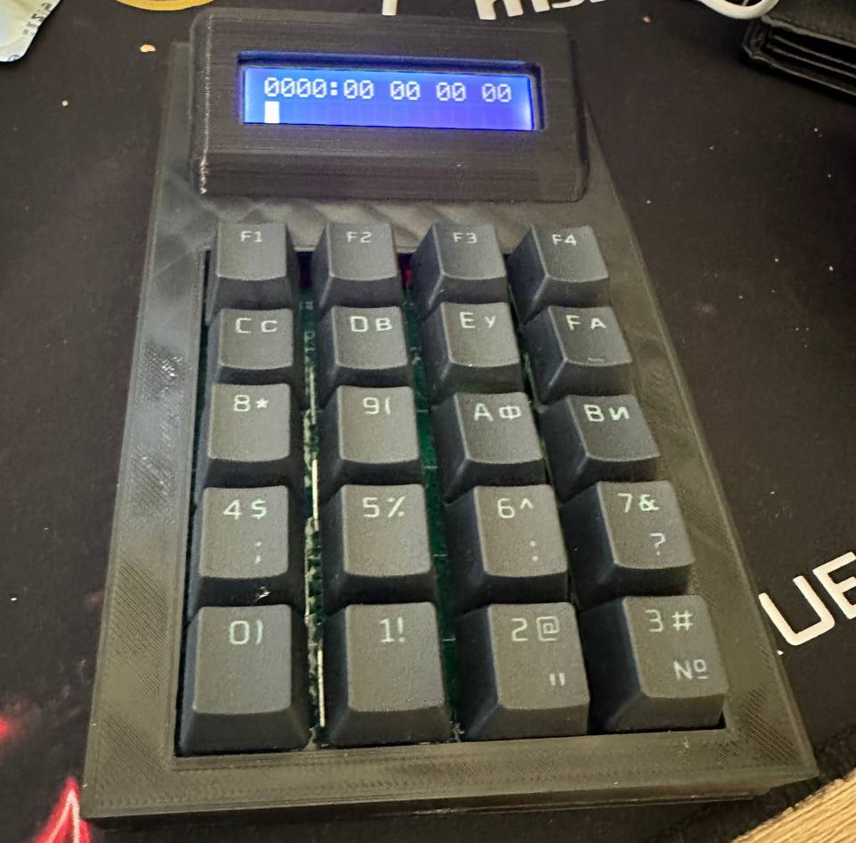
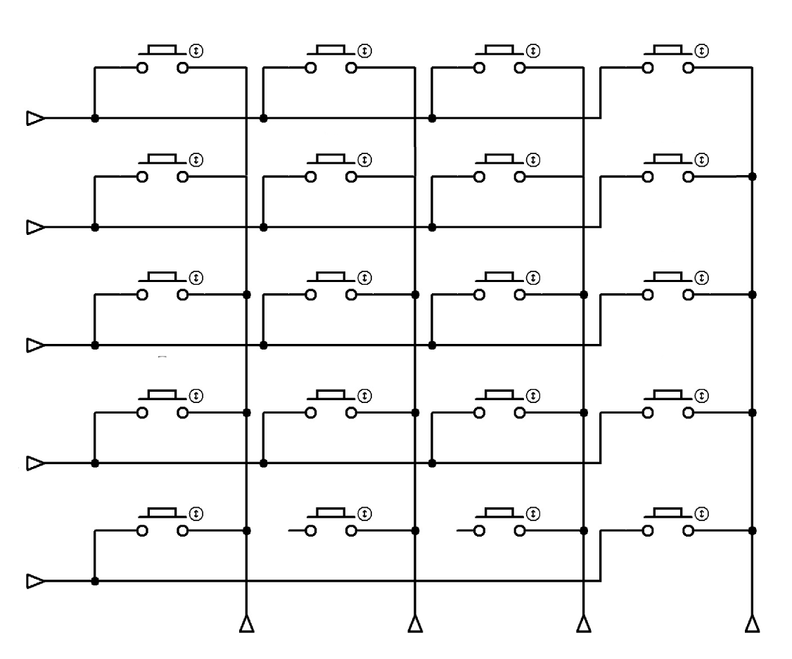

# Micro UNO

Birinchi mikrokompyuterlar yoki umuman miktoprotsessorlarning qanday ishlashini o'rganmoqchi bo'lsangiz unda ushbu konstruksiya siz uchun ayni muddao. Konstruksiya uchun barcha kerakli ehtiyot qismlarni O'zbekiston sharoitida muammosiz topishingiz mumkin. Shuningdek 3D printerda chop etish uchun modellar ham biriktirilgan.

Youtube video: [https://www.youtube.com/watch?v=Z8Tm94-23g4](https://www.youtube.com/watch?v=Z8Tm94-23g4)



## Talablar

- Atmega328
- UART to USB
- LCD16x2
- Matritsali klaviatura

## Matritsali klaviatura



## Ishga tushirish va foydalanish

Qurilmada instruksiyalardan foydalanishi uchun 1024Kb dinamik xotira ajratilgan, hozircha dasturlarni ma'lum bir xotiraga saqlash va xotiradan qayta yuklash imkoni mavjud emas (Keyingi versiyalar uchun shinalar bilan ishlash va fayl strukturasi qo'shish rejalashtirilgan).

Har bir seksiyalar to'rt qismdan o'qish va yozish uchun mo'ljallangan:

`0x0000: 00 00 00 00`

Bunda `0x0000` xotira manzili, `00 00 00 00` xotira manzilida yozilgan ma'lumotlar hisoblanadi.

Misol: 0x0000: 01 41 0f 00

```
Manzil - 0x0000, qiymat - 01 // A registerga ma'lumot kiritish
Manzil - 0x0001, qiymat - 58 // ASCII jadvali bo'yicha A registerga kiritilgan X harfi  
Manzil - 0x0002, qiymat - 0f // A registerdan ekranga chiqarish
Manzil - 0x0003, qiymat - 00 // Program counterni tiklash (sikldan chiqish)
```

Ishga tushirish: `0xffff`
Qayta ishga tushirish: `0xfffb`
Ekranni tozalash: `0xfffa`
Xotira manzilidan o'qish: `0xfffc`
UART orqali ma'lumotlarni o'qish: `0xfffd`
Ma'lumotlarni UART orqali saqlash: `0xfffe`

_Barcha instruksiyalar bilan [instruction_set](assets/instruction_set.pdf) fayli orqali tanishingiz mumkin. Shuningdek [samples](samples/)_ papkasida bir necha misollar ham ko'rsatilgan.

## Dasturlarni UART orqali yuklash

Kerakli dasturlarni assembler orqali odatiy matn muharrirda yozib [compiler.php](compiler/compiler.php) dasturi orqali mashina kodiga o'girishingiz va qurilmaga yuklashingiz mumkin. Bu uchun mikrokompyuterdan `fffd` buyrug'i orqali yuklash rejimiga o'tish lozim.